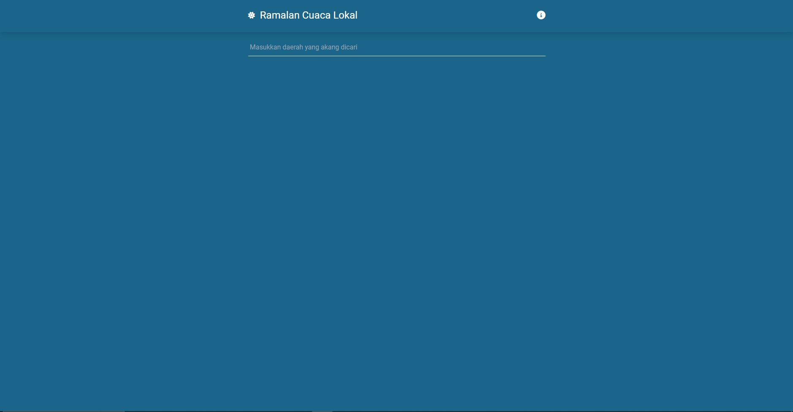
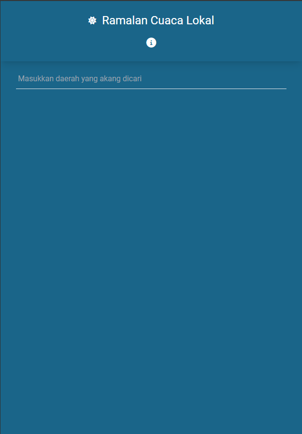
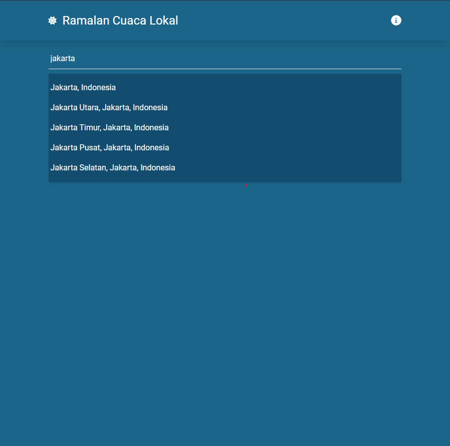
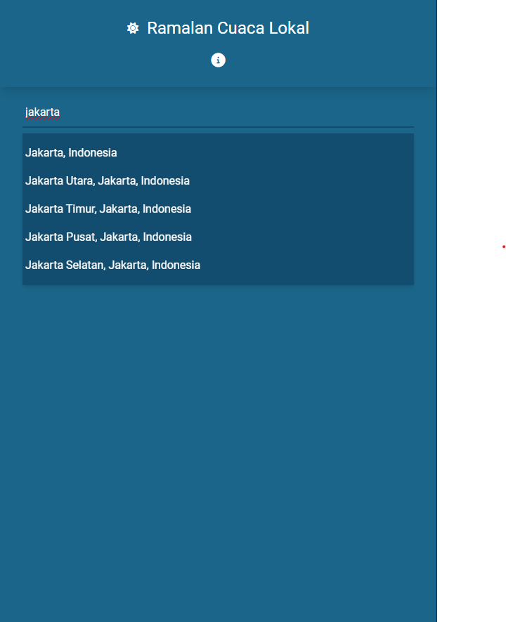
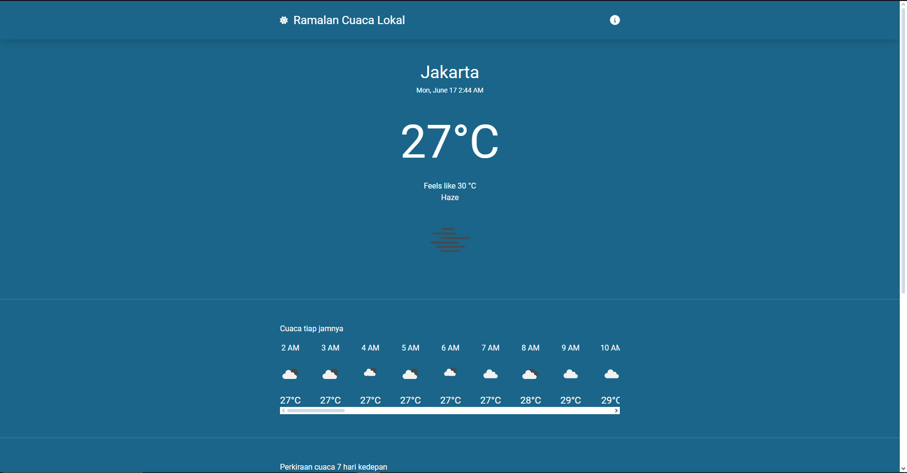
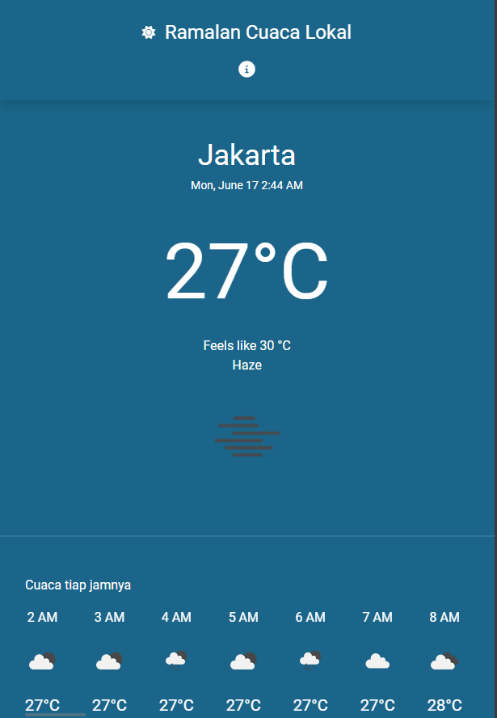

# Weather-app

This is a weather app using geocoding and openweather API. This is project are made to finish a take home test for my internship. [LIVE DEMO](https://weather-app.up.railway.app)

# Installation

1. Vite + Vue setup : <br/>You can setup vue using vite by following this guide : https://github.com/vuejs/create-vue.
2. Installing TailwindCSS : <br/>You can setup tailwind for vite by following this guide : https://tailwindcss.com/docs/guides/vite

# Running the app

To run the application is required to have passed through the [Instalation](#installation). With that out of the way, we just need to run the app:

```
npm run dev
```

# Idea and Demo

This project was planned with the idea that user would be able to inquire about the local weather or certain area around the world. To implement this i decided to use [geocoding API](https://docs.mapbox.com/api/search/geocoding/) to get the geolocation of the area that user want to check, and then using [openweather API](https://openweathermap.org/api/one-call-3) to get the local weather around that area. And to increase website responsiveness i decided to use [tailwindCSS](tailwindcss.com/docs).
<br/>
<br/>
How the app work:

1. Access the [live demo](https://weather-app.up.railway.app)
2. User would be ask to input the area that would be check :
<figure>
    
    <figcaption>Design from a desktop prospective</figcaption>
</figure>
<br/><br/>
<figure>
    
    <figcaption>Design from a mobile prospective</figcaption>
</figure>
<br/><br/>
3. After user input the area, they would be able to choose the correct address from the option available :
<figure>
    
    <figcaption>Design from a desktop prospective</figcaption>
</figure>
<br/><br/>
<figure>
    
    <figcaption>Design from a mobile prospective</figcaption>
</figure>
<br/><br/>
4. After user clicked the address, they'll be redirected to the weather view of that area :
<figure>
    
    <figcaption>Design from a desktop prospective</figcaption>
</figure>
<br/><br/>
<figure>
    
    <figcaption>Design from a mobile prospective</figcaption>
</figure>
<br/><br/>

# File structure description

```
├───.vscode
├───node_modules
├───public
│       favicon.ico
│
├───src
│   │   App.vue
│   │   main.js
│   │
│   ├───assets
│   │   │   tailwind.css
│   │   │
│   │   └───demo
│   ├───components
│   │   │   AsyncCityView.vue
│   │   │   BaseModal.vue
│   │   │   SiteNavigation.vue
│   │   │
│   │   └───icons
│   ├───router
│   │       index.js
│   │
│   ├───stores
│   │       counter.js
│   │       handler.js
│   │
│   └───views
│           CityView.vue
│           HomeView.vue
│   .eslintrc.cjs
│   .gitignore
│   .prettierrc.json
│   index.html
│   jsconfig.json
│   package-lock.json
│   package.json
│   postcss.config.js
│   README.md
│   tailwind.config.js
│   tree.txt
│   vite.config.js
│

```

<br>
<br>
